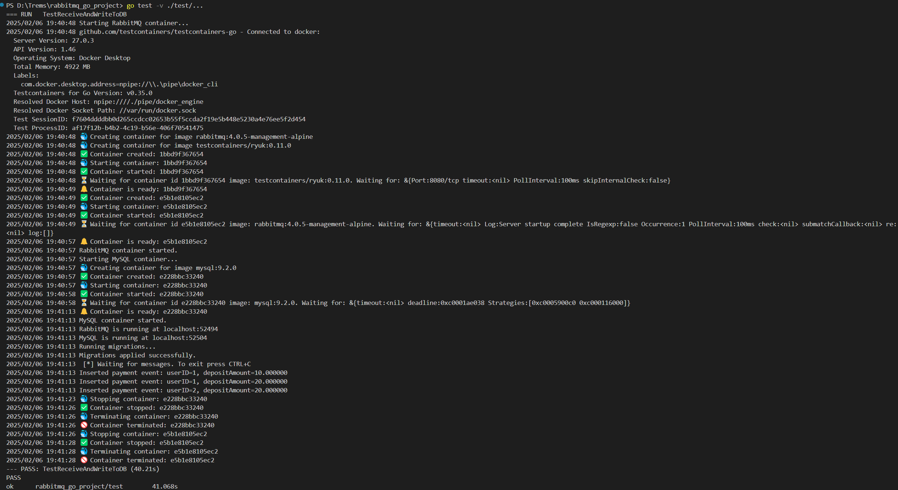

# RabbitMQ Go Project

This project demonstrates how to use RabbitMQ with a Go application. It includes functionality for sending and receiving messages, as well as writing received messages to a MySQL database.

## What I Did

1. **Learning Go and RabbitMQ**: I started by reading the official documentation and creating a simple "Hello World" application to understand the basics of both technologies.
2. **Project Organization**: I structured the project following Go's recommended layout, creating separate directories for commands (`cmd`), internal logic (`internal`), reusable packages (`pkg`), and database migrations (`db/migrations`).
3. **Core Functionality**:
   - Implemented the **send** component, which publishes messages to RabbitMQ.
   - Implemented the **receive** component, which consumes messages from RabbitMQ and writes them to a MySQL database.
4. **Testing**: Used TestContainers to spin up RabbitMQ and MySQL containers for integration tests, ensuring an isolated and consistent test environment.
5. **Documentation**: Wrote setup and usage instructions in `README.md` to help others understand and run the project.

## Areas for Improvement

### 1. Code Reusability and SOLID Principles
- Refactor the code to better follow SOLID principles, ensuring improved separation of concerns and reusability.

### 2. Dockerization
- Create Docker images for the sender, receiver, and database to facilitate deployment and scaling.

### 3. Configuration Management
- Move hardcoded configurations (RabbitMQ and MySQL connection details) to environment variables or configuration files for flexibility.

### 4. Monitoring and Logging
- Implement logging and monitoring using tools like Grafana and Prometheus to track application performance.

### 5. Error Handling and Testing
- Improve error handling for robustness.
- Expand test coverage to include more edge cases and failure scenarios.

### 6. Documentation
- Enhance documentation to explain the application's architecture, design decisions, and provide detailed usage examples.

## Project Structure

```
├── cmd
│   ├── receive
│   │   └── main.go    # Entry point for the message receiver
│   ├── send
│   │   └── main.go    # Entry point for the message sender
├── internal
│   ├── receive
│   │   └── receive.go # Logic for receiving messages and writing to the database
│   ├── send
│   │   └── send.go    # Logic for sending messages to RabbitMQ
├── pkg
│   ├── db
│   │   └── db.go      # Database connection and query functions
|   ├── models 
│   │   └── models.go # Data models used in the application
├── test
│   ├── receive_test.go # Integration tests for the message receiver
├── db
│   ├── migrations     # Database migration files
├── assets 
│   ├── test_success.png # Image illustrating the test results
```

## Prerequisites

- Go 1.18 or later
- Docker & Docker Compose
- MySQL

## Auxiliary Links
Here are some useful links that were used during the development process:

- [Go Database Access Tutorial](https://go.dev/doc/tutorial/database-access)
- [RabbitMQ Go Tutorial](https://www.rabbitmq.com/tutorials/tutorial-one-go)


## Setup

1. **Start RabbitMQ and MySQL using Docker Compose:**

    ```sh
    docker-compose up -d
    ```

2. **Run database migrations:**

    ```sh
    migrate -database "mysql://<DB_USER>:<DB_PASSWORD>@tcp(<DB_HOST>:<DB_PORT>)/<DB_NAME>" -path db/migrations up
    ```

## Running the Application

### Running the Receiver
The receiver listens for messages from RabbitMQ and writes them to MySQL.

```sh
go run cmd/receive/main.go
```

### Running the Sender
The sender publishes messages to RabbitMQ.

```sh
go run cmd/send/main.go
```

## Running Tests

Run the integration tests:

```sh
go test -v ./test/...
```

## RabbitMQ Go Project - Testing Run Success
Below is an image illustrating the test results, confirming that passed successfully.


